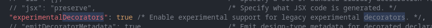

## Decorators

### O que são os decorators?

-   Decorators podem adicionar funcionalidades extras a classes e funções
-   Basicamente criamos novas funções, que são adicionadas a partir de um @nome
-   Esta função será chamada assim que o item que foi definido o decorator for executado
-   Para habilitar precisamos adicionar uma configuração no tsconfig.json:
    

### Primeiro decorator

-   Vamos criar um decorator como uma function
-   Ele pode trabalhar com argumentos especiais que são: target, propertyKey e descriptor
-   Estes são os grandes trunfos do decorator, pois nos dão informação do local em que ele foi executado

### Múltiplos decorators

-   Podemos utilizar múltiplos decorators em TS
-   O primeiro a ser executado é o que está mais abaixo do código
-   Desta maneira é possível criar operações mais complexas

### Decorator de classe

-   O decorator de classe está ligado ao constructor
-   Ou seja, sempre que este for executado, teremos a execução do decorator
-   Isso nos permite acrescentar algo a criação de classes

### Decorator de método

-   Com este decorator podemos modificar a execução de métodos
-   Precisamos inserir o decorator antes da declaração do método
-   Ele é executado antes do método

### Accessor decorator

-   Semelhante ao decorator de método
-   Porém este serve apenas para os getters e setters
-   Podemos alterar a execução antes de um set ou get

### Property decorator

-   O property decorator é utilizado nas propriedades de uma classe
-   Ou seja, na hora da definição da mesma podemos ativar uma função
-   Isso nos ajuda a modificar ou validar algum valor

### Exemplo real: Class Decorator

-   Com Class Decorator podemos influenciar o constructor
-   Neste exemplo vamos criar uma função para inserir data de criação dos objetos

### Exemplo real: Class Decorator

-   Com Class Decorator podemos influenciar o constructor
-   Neste exemplo vamos criar uma função para inserir data de criação dos objetos

### Exemplo real: Method Decorator

-   Com Method Decorator podemos alterar a execução dos métodos
-   Neste exemplo vamos verificar se um usuário pode ou não fazer uma alteração no sistema
-   A alteração seria o método a ser executado

### Exemplo real: Property Decorator

-   Com o Property Decorator conseguimos verificar uma propriedade de um objeto
-   Vamos criar uma validação de número máximo de caracteres com decorators

###
